# Monitorizarea Starii unui Sistem

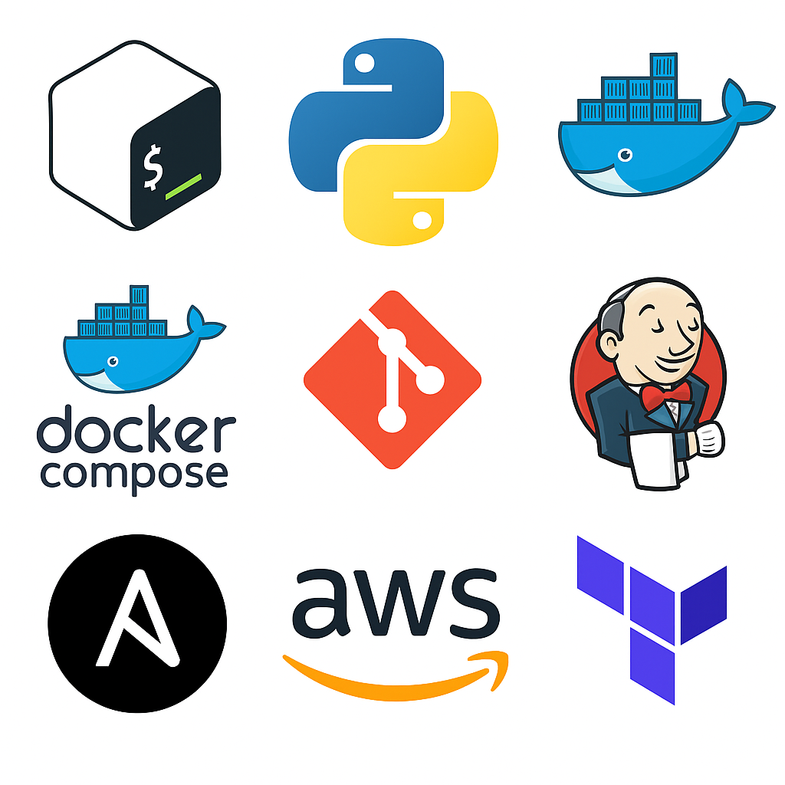

## Scopul Proiectului
Proiectul presupune dezvoltarea unei platforme DevOps pentru monitorizarea stării unui sistem informatic folosind bash, Python, Docker, Ansible, Jenkins, AWS si Terraform. Utilizatorii vor putea observa evolutia utilizarii următoarelor resurse: cpu, memorie, număr de procese active și utilizare disk. Platforma trebuie să pastreze istoricul stării sistemelor pentru a le permite administratorilor de sistem să ia decizii legate de scalare.

## Structura proiectului

Proiectul este structurat astfel incat fiecare tehnologie folosita sa se afle in director separat. 

```
teme@vm2:~/git-projects/proiect$ tree
.
├── ansible
│   ├── inventory.ini
│   └── playbook.yml
├── docker
│   ├── docker-compose.yml
│   ├── Dockerfile-backup
│   ├── Dockerfile-monitor
│   └── scripts
├── jenkins
│   └── setup
│       ├── docker-compose.yml
│       └── start-jenkins.sh
├── README.md
├── scripts
│   ├── backup
│   │   ├── log.sh.2025-08-10-15-55-30.backup
│   │   ├── system-state.log.2025-08-05-16-52-35.backup
│   ├── backup.py
│   ├── log.sh
│   └── system-state.log
└── terraform

```

## Setup si Rulare
### Scriptul de bash

**Bash** pentru realizarea scriptului de monitorizare stare sistem.

Pentru a putea rula scriptul trebuie sa dam permisiuni de executie: chmod +x log.sh
Rulam ./log.sh 
Cat system-state.log 

### Scriptul de python

**Python** pentru realizarea scriptului de backup al informațiilor de sistem colectate

Trebuie instalat python3
teme@vm2:~/git-projects/proiect$ python3 --version
Python 3.10.12
```
teme@vm2:~/git-projects/proiect/scripts$ python3 backup.py
2025-08-05 16:52:31,020 - ERROR - Te rog sa specifici calea catre fisier!!!
teme@vm2:~/git-projects/proiect/scripts$ python3 backup.py system-state.log 
2025-08-05 16:52:35,105 - WARNING - Directorul backup nu exista. Il creez..
2025-08-05 16:52:35,106 - DEBUG - Exista fisierul system-state.log.
2025-08-05 16:52:35,115 - INFO - Rezultatul comenzii md5sum, este [b'c6633985d184cbb43f74768870521e9e', b'system-state.log'].
2025-08-05 16:52:35,115 - INFO - Hash-ul fisierului system-state.log este c6633985d184cbb43f74768870521e9e
c6633985d184cbb43f74768870521e9e

```
### Docker

**Docker** pentru împachetarea scripturilor în containere.

Verificam daca este instalat docker, daca nu este putem urmari pasii de instalare din documentatie.

```
teme@vm2:~/git-projects/proiect$ docker --version
Docker version 28.3.2, build 578ccf6
```
Verificam daca este pornit vreun container
```
teme@vm2:~/git-projects/proiect$ docker ps
CONTAINER ID   IMAGE     COMMAND   CREATED   STATUS    PORTS     NAMES
```
Verificam daca userul e adaugat in grupul docker, daca nu este il adaugam. Acest lucru ne ajuta sa rulam comenzile de docker fara sudo 
```
teme@vm2:~/git-projects/proiect$ groups
teme sudo docker vboxsf
```
Daca userul nu era adaugat in grupul docker il adaugam cu comanda: sudo usermod -aG docker teme
Am creat 2 Dockerfile, unul pentru scriptul sh si unul pentru cel de python
Construim imaginea cu tag-ul "monitor iamge"
```

teme@vm2:~/git-projects/proiect$ docker build -t monitor-image -f docker/Dockerfile-monitor .
[+] Building 8.8s (10/10) FINISHED                                                                                   docker:default
 => [internal] load build definition from Dockerfile-monitor                                                                   0.0s
 => => transferring dockerfile: 160B                                                                                           0.0s
 => [internal] load metadata for docker.io/library/ubuntu:latest                                                               0.5s
 => [internal] load .dockerignore                                                                                              0.0s
 => => transferring context: 2B                                                                                                0.0s
 => [1/5] FROM docker.io/library/ubuntu:latest@sha256:a08e551cb33850e4740772b38217fc1796a66da2506d312abe51acda354ff061         3.7s
 => => resolve docker.io/library/ubuntu:latest@sha256:a08e551cb33850e4740772b38217fc1796a66da2506d312abe51acda354ff061         0.0s
 => => sha256:65ae7a6f3544bd2d2b6d19b13bfc64752d776bc92c510f874188bfd404d205a3 2.30kB / 2.30kB                                 0.0s
 => => sha256:32f112e3802cadcab3543160f4d2aa607b3cc1c62140d57b4f5441384f40e927 29.72MB / 29.72MB                               2.2s
 => => sha256:a08e551cb33850e4740772b38217fc1796a66da2506d312abe51acda354ff061 6.69kB / 6.69kB                                 0.0s
 => => sha256:4f1db91d9560cf107b5832c0761364ec64f46777aa4ec637cca3008f287c975e 424B / 424B                                     0.0s
 => => extracting sha256:32f112e3802cadcab3543160f4d2aa607b3cc1c62140d57b4f5441384f40e927                                      1.4s
 => [internal] load build context                                                                                              0.0s
 => => transferring context: 739B                                                                                              0.0s
 => [2/5] RUN apt-get update                                                                                                   3.7s
 => [3/5] WORKDIR /src                                                                                                         0.1s 
 => [4/5] COPY scripts/log.sh .                                                                                                0.1s 
 => [5/5] RUN chmod +x log.sh                                                                                                  0.3s 
 => exporting to image                                                                                                         0.3s 
 => => exporting layers                                                                                                        0.3s 
 => => writing image sha256:c5b39453beca8c21d01b4129ea1308aea75fe061226440625b9dbe82d28a6b93                                   0.0s 
 => => naming to docker.io/library/monitor-image  
```
 Deoarece scriptul de shell se afla in alt director decat cel de docker in care am incercat prima data sa rulez comanda docker build, am iesit din director, am rulat comanda in directorul principal si am specifical directorul in care se afla docker file-ul 

 Verificam ca s-a construit imaginea:
 ```
 teme@vm2:~/git-projects/proiect$ docker images
REPOSITORY      TAG       IMAGE ID       CREATED          SIZE
monitor-image   latest    c5b39453beca   28 seconds ago   130MB
buna            latest    5f6cfed4e499   13 days ago      1.02GB
<none>          <none>    a44a288defe1   13 days ago      1.02GB
alpine          latest    9234e8fb04c4   3 weeks ago      8.31MB
nginx           latest    2cd1d97f893f   3 weeks ago      192MB
hello-world     latest    74cc54e27dc4   6 months ago     10.1kB
```
Vom proceda la fel si pentru imaginea scriptului de backup
```
teme@vm2:~/git-projects/proiect$ docker build -t backup-image -f docker/Dockerfile-backup .
[+] Building 1.7s (8/8) FINISHED                                                                                     docker:default
 => [internal] load build definition from Dockerfile-backup                                                                    0.0s
 => => transferring dockerfile: 165B                                                                                           0.0s
 => [internal] load metadata for docker.io/library/python:latest                                                               1.3s
 => [internal] load .dockerignore                                                                                              0.0s
 => => transferring context: 2B                                                                                                0.0s
 => CACHED [1/3] FROM docker.io/library/python:latest@sha256:4ea77121eab13d9e71f2783d7505f5655b25bb7b2c263e8020aae3b555dbc0b2  0.0s
 => => resolve docker.io/library/python:latest@sha256:4ea77121eab13d9e71f2783d7505f5655b25bb7b2c263e8020aae3b555dbc0b2         0.0s
 => [internal] load build context                                                                                              0.0s
 => => transferring context: 2.17kB                                                                                            0.0s
 => [2/3] WORKDIR /src                                                                                                         0.1s
 => [3/3] COPY scripts/backup.py .                                                                                             0.1s
 => exporting to image                                                                                                         0.1s
 => => exporting layers                                                                                                        0.0s
 => => writing image sha256:f284f27a76188e7b249e34ed588469e498544eb1cb7878b45bfcba00d1de38b8                                   0.0s
 => => naming to docker.io/library/backup-image                                                                                0.0s
teme@vm2:~/git-projects/proiect$ docker images
REPOSITORY      TAG       IMAGE ID       CREATED          SIZE
backup-image    latest    f284f27a7618   5 seconds ago    1.02GB
monitor-image   latest    c5b39453beca   13 minutes ago   130MB
buna            latest    5f6cfed4e499   13 days ago      1.02GB
<none>          <none>    a44a288defe1   13 days ago      1.02GB
alpine          latest    9234e8fb04c4   3 weeks ago      8.31MB
nginx           latest    2cd1d97f893f   3 weeks ago      192MB
hello-world     latest    74cc54e27dc4   6 months ago     10.1kB
```
Rulam imaginile in detache mod si le da un nume pentru a ne fi mai usor de pornit/oprit containerele

```

teme@vm2:~/git-projects/proiect$ docker images
REPOSITORY        TAG       IMAGE ID       CREATED          SIZE
backup-image      latest    b98a02365501   3 seconds ago    1.02GB
monitor-image     latest    63dd09036c09   27 seconds ago   130MB
checklog-image    latest    1238af44988a   3 days ago       1GB
buna              latest    5f6cfed4e499   2 weeks ago      1.02GB
jenkins/jenkins   lts       627182afbe2b   2 weeks ago      472MB
alpine            latest    9234e8fb04c4   3 weeks ago      8.31MB
nginx             latest    2cd1d97f893f   3 weeks ago      192MB
hello-world       latest    74cc54e27dc4   6 months ago     10.1kB
```
Pornim containere carora le dam si un nume pentru a fi mai usor e gestionat
```
teme@vm2:~/git-projects/proiect$ docker run -d --name monitor-backup -v shared-volume:/src monitor-image 
f90b60ceca5b5abd6400cb1153bb30737a655c2d058c3645b75faa3648e75ecf
teme@vm2:~/git-projects/proiect$ docker run -d --name system-backup -v shared-volume:/src backup-image /src/system-state.log
febd62da5aa94a17bffe96cf466e09ec01f443e4812b697e7ab333b18d5a3055
teme@vm2:~/git-projects/proiect$ docker ps
CONTAINER ID   IMAGE           COMMAND                  CREATED          STATUS         PORTS     NAMES
febd62da5aa9   backup-image    "python /app/backup.…"   3 seconds ago    Up 2 seconds             system-backup
f90b60ceca5b   monitor-image   "bash log.sh"            10 seconds ago   Up 9 seconds             monitor-backup
teme@vm2:~/git-projects/proiect$ docker exec -it system-backup 
```
Pentru a rula a trebuit sa montam un volum comun
Am verificat ca s-au creat fisierele de backup intrand in container 
```
teme@vm2:~/git-projects/proiect$ docker exec -it system-backup sh
# ls
backup  log.sh  system-state.log
# cd backup
# ls
system-state.log.2025-08-13-19-44-09.backup  system-state.log.2025-08-13-19-44-39.backup  system-state.log.2025-08-13-19-45-10.backup  system-state.log.2025-08-13-19-45-41.backup
system-state.log.2025-08-13-19-44-14.backup  system-state.log.2025-08-13-19-44-44.backup  system-state.log.2025-08-13-19-45-15.backup  system-state.log.2025-08-15-17-51-50.backup
system-state.log.2025-08-13-19-44-19.backup  system-state.log.2025-08-13-19-44-49.backup  system-state.log.2025-08-13-19-45-20.backup  system-state.log.2025-08-15-17-51-55.backup
system-state.log.2025-08-13-19-44-24.backup  system-state.log.2025-08-13-19-44-54.backup  system-state.log.2025-08-13-19-45-26.backup  system-state.log.2025-08-15-17-52-01.backup
system-state.log.2025-08-13-19-44-29.backup  system-state.log.2025-08-13-19-45-00.backup  system-state.log.2025-08-13-19-45-31.backup  system-state.log.2025-08-15-17-52-06.backup
system-state.log.2025-08-13-19-44-34.backup  system-state.log.2025-08-13-19-45-05.backup  system-state.log.2025-08-13-19-45-36.backup  system-state.log.2025-08-15-17-52-11.backup
# 
```
Oprim containerele si le stergem. Procedam la fel si cu imaginile

```
teme@vm2:~/git-projects/proiect$ docker ps
CONTAINER ID   IMAGE           COMMAND                  CREATED          STATUS          PORTS     NAMES
d7fcac47f5ed   backup-image    "python /app/backup.…"   15 seconds ago   Up 14 seconds             system-backup
a6d694052019   monitor-image   "bash log.sh"            15 seconds ago   Up 14 seconds             system-monitor
teme@vm2:~/git-projects/proiect$ docker stop system-monitor system-backup 
system-monitor
system-backup
teme@vm2:~/git-projects/proiect$ docker rm -f system-monitor system-backup 
system-monitor
system-backup
teme@vm2:~/git-projects/proiect$ docker images
REPOSITORY        TAG       IMAGE ID       CREATED          SIZE
monitor-image     latest    95a563e5a84e   12 minutes ago   130MB
backup-image      latest    7f2e8fa2d74b   46 hours ago     1.11GB
<none>            <none>    d703edd854bf   47 hours ago     1.11GB
<none>            <none>    5dea3a437061   5 days ago       1.02GB
<none>            <none>    63dd09036c09   5 days ago       130MB
checklog-image    latest    1238af44988a   9 days ago       1GB
buna              latest    5f6cfed4e499   3 weeks ago      1.02GB
jenkins/jenkins   lts       627182afbe2b   3 weeks ago      472MB
alpine            latest    9234e8fb04c4   4 weeks ago      8.31MB
nginx             latest    2cd1d97f893f   4 weeks ago      192MB
hello-world       latest    74cc54e27dc4   6 months ago     10.1kB
teme@vm2:~/git-projects/proiect$ docker rmi -f monitor-image:latest backup-image:latest 
Untagged: monitor-image:latest
Deleted: sha256:95a563e5a84ec3692b31eff1d4ed33f6e91bef6ae18d12c5ad8f6ca84823c40f
Untagged: backup-image:latest
Deleted: sha256:7f2e8fa2d74b1fd339e86938ed75b45fcc03a8714a8e10b3789b8477fb559fd2

```

**Docker Compose** este folosit pentru rularea locală a platformei.

Rularea docker compose:

Am pornit containerele
```
teme@vm2:~/git-projects/proiect$ docker compose -f docker/docker-compose.yml up -d
Creating network "docker_default" with the default driver
Creating docker_sytem-backup_1  ... done
Creating docker_sytem-monitor_1 ... done
teme@vm2:~/git-projects/proiect$ docker ps
CONTAINER ID   IMAGE           COMMAND                  CREATED         STATUS         PORTS     NAMES
536ab870de2f   monitor-image   "bash log.sh"            5 seconds ago   Up 4 seconds             docker_sytem-monitor_1
5b2378b3bca0   backup-image    "python backup.py sy…"   5 seconds ago   Up 4 seconds             docker_sytem-backup_1
teme@vm2:~/git-projects/proiect$ tree
.
├── ansible
│   └── inventory.ini
├── docker
│   ├── docker-compose.yml
│   ├── Dockerfile-backup
│   ├── Dockerfile-monitor
│   └── scripts
├── jenkins
│   └── setup
│       ├── docker-compose.yml
│       └── start-jenkins.sh
├── README.md
├── scripts
│   ├── backup
│   │   ├── log.sh.2025-08-10-15-55-30.backup
│   │   ├── system-state.log.2025-08-05-16-52-35.backup
│   │   ├── system-state.log.2025-08-10-14-13-09.backup
│   │   ├── system-state.log.2025-08-10-14-13-14.backup
│   │   ├── system-state.log.2025-08-10-14-13-19.backup
│   │   ├── system-state.log.2025-08-10-14-13-24.backup
│   │   ├── system-state.log.2025-08-10-14-13-29.backup
│   │   ├── system-state.log.2025-08-10-14-13-34.backup
│   │   ├── system-state.log.2025-08-10-14-13-45.backup
│   │   ├── system-state.log.2025-08-10-14-13-50.backup
│   │   └── system-state.log.2025-08-10-14-13-55.backup
│   ├── backup.py
│   ├── log.sh
│   └── system-state.log
└── terraform
```
Si le-am oprit pentru ca se genereau foarte mult fisirele de backup cu comanda: 
**docker-compose -f docker/docker-compose.yml down**

### ANSIBLE

**Ansible** este folosit pentru instalarea platformei pe un server remote.

Am instalat o noua masina virtuala, cu aceleasi caracteristici ca masina main. Pe masina remote am creat userul "remote"

Instalam serviciul ssh pe masina remote pentru a putea stabili comunicare ssh intre cele doua masina: 

Pe masina remote mai rulam si comanda: 
```
ansible@ansibleproiect:~$ echo "ansible ALL=(ALL) NOPASSWD:ALL" | sudo tee -a ansible-nopasswd
ansible ALL=(ALL) NOPASSWD:ALL
```
---> pentru a putea executa comanda sudo fara parola

In fisierul inventory am adaugat adresa ip a masinii remote (cea cu care am facut legatura SSH) si userul acesteia

```
ansible@ansibleproiect:~$ groups
ansible sudo vboxsf
ansible@ansibleproiect:~$ docker --version
Command 'docker' not found, but can be installed with:
sudo snap install docker         # version 28.1.1+1, or
sudo apt  install docker.io      # version 26.1.3-0ubuntu1~22.04.1
sudo apt  install podman-docker  # version 3.4.4+ds1-1ubuntu1.22.04.3
See 'snap info docker' for additional versions.
```
Am verificat ca pe masina remote nu este instalat docker si ca userulnou creat nu face parte din grup.
```
teme@vm2:~/git-projects/proiect/ansible$ ansible-playbook -i inventory playbook.yml 
[WARNING]: Unable to parse /home/teme/git-projects/proiect/ansible/inventory as an inventory source
[WARNING]: No inventory was parsed, only implicit localhost is available
[WARNING]: provided hosts list is empty, only localhost is available. Note that the implicit localhost does not match 'all'
[WARNING]: Could not match supplied host pattern, ignoring: server

PLAY [Install & Configure Docker] **************************************************************************************************************************************************************************
skipping: no hosts matched

PLAY RECAP ******************************************************************

teme@vm2:~/git-projects/proiect/ansible$ ping 192.168.0.150
PING 192.168.0.150 (192.168.0.150) 56(84) bytes of data.
64 bytes from 192.168.0.150: icmp_seq=1 ttl=64 time=5.85 ms
64 bytes from 192.168.0.150: icmp_seq=2 ttl=64 time=1.26 ms
64 bytes from 192.168.0.150: icmp_seq=3 ttl=64 time=1.48 ms
64 bytes from 192.168.0.150: icmp_seq=4 ttl=64 time=2.31 ms
64 bytes from 192.168.0.150: icmp_seq=5 ttl=64 time=1.77 ms
64 bytes from 192.168.0.150: icmp_seq=6 ttl=64 time=2.01 ms
64 bytes from 192.168.0.150: icmp_seq=7 ttl=64 time=2.46 ms
64 bytes from 192.168.0.150: icmp_seq=8 ttl=64 time=2.64 ms
64 bytes from 192.168.0.150: icmp_seq=9 ttl=64 time=1.60 ms
64 bytes from 192.168.0.150: icmp_seq=10 ttl=64 time=1.62 ms
64 bytes from 192.168.0.150: icmp_seq=11 ttl=64 time=2.31 ms
64 bytes from 192.168.0.150: icmp_seq=12 ttl=64 time=2.01 ms
64 bytes from 192.168.0.150: icmp_seq=13 ttl=64 time=2.33 ms
64 bytes from 192.168.0.150: icmp_seq=14 ttl=64 time=3.97 ms
c64 bytes from 192.168.0.150: icmp_seq=15 ttl=64 time=2.13 ms
^C64 bytes from 192.168.0.150: icmp_seq=16 ttl=64 time=2.33 ms
^C
--- 192.168.0.150 ping statistics ---
16 packets transmitted, 16 received, 0% packet loss, time 15437ms
rtt min/avg/max/mdev = 1.262/2.379/5.850/1.079 ms
teme@vm2:~/git-projects/proiect/ansible$ ssh ansible@192.168.0.150
Welcome to Ubuntu 22.04.5 LTS (GNU/Linux 6.8.0-65-generic x86_64)

 * Documentation:  https://help.ubuntu.com
 * Management:     https://landscape.canonical.com
 * Support:        https://ubuntu.com/pro

Expanded Security Maintenance for Applications is not enabled.

71 updates can be applied immediately.
To see these additional updates run: apt list --upgradable

Enable ESM Apps to receive additional future security updates.
See https://ubuntu.com/esm or run: sudo pro status

Last login: Fri Aug  8 13:59:50 2025 from 192.168.0.11
ansible@ansibleproiect:~$ exit
logout
Connection to 192.168.0.150 closed.
```
Am rulat comanda cu -K pentru ca sa putem introduce parola userului de pe masina remote unde se face instalarea dockerului
```
teme@vm2:~/git-projects/proiect/ansible$ ansible-playbook -i inventory.ini playbook.yml -K
BECOME password: 

PLAY [Install & Configure Docker] *********************************************************************************************************************************************************************************

TASK [Gathering Facts] ********************************************************************************************************************************************************************************************
[WARNING]: Platform linux on host server is using the discovered Python interpreter at /usr/bin/python3.10, but future installation of another Python interpreter could change the meaning of that path. See
https://docs.ansible.com/ansible-core/2.17/reference_appendices/interpreter_discovery.html for more information.
ok: [server]

TASK [Update packages] ********************************************************************************************************************************************************************************************
changed: [server]

TASK [Install required packages for Docker] ***********************************************************************************************************************************************************************
ok: [server]

TASK [Add Docker GPG apt Key] *************************************************************************************************************************************************************************************
ok: [server]

TASK [Add Docker Repository] **************************************************************************************************************************************************************************************
ok: [server]

TASK [Ensure group "docker" exists with correct gid] **************************************************************************************************************************************************************
ok: [server]

TASK [Add user to the "docker" group] *****************************************************************************************************************************************************************************
ok: [server]

TASK [Install docker-ce] ******************************************************************************************************************************************************************************************
changed: [server]
```
Pe masina remote verificam daca s-a instalat docker, daca userulull a fost adaugat in grup
```
ansible@ansibleproiect:~$ docker --version
Docker version 28.1.1, build 4eba377
ansible@ansibleproiect:~$ groups
ansible sudo vboxsf docker
ansible@ansibleproiect:~$ docker compose version
Docker Compose version v2.35.1
```
Rulam comanda:

```
teme@vm2:~/git-projects/proiect/ansible$ ansible-playbook -i inventory.ini playbook2.yml -K
BECOME password: 

PLAY [Run Docker Compose] **********************************************************************************************************************************************************************************

TASK [Gathering Facts] *************************************************************************************************************************************************************************************
[WARNING]: Platform linux on host server is using the discovered Python interpreter at /usr/bin/python3.10, but future installation of another Python interpreter could change the meaning of that path.
See https://docs.ansible.com/ansible-core/2.17/reference_appendices/interpreter_discovery.html for more information.
ok: [server]

TASK [Copy docker compose to the remote vm] ****************************************************************************************************************************************************************
changed: [server]

TASK [Run docker-compose up in detached mode] **************************************************************************************************************************************************************
changed: [server]

TASK [Verify that containers are running] ******************************************************************************************************************************************************************
changed: [server]

TASK [Display containers status] ***************************************************************************************************************************************************************************
ok: [server] => {
    "msg": "Starea containerelor este: ['CONTAINER ID   IMAGE           COMMAND                  CREATED         STATUS         PORTS     NAMES', '64ad7f04b4ce   backup-image    \"python backup.py sy…\"   3 seconds ago   Up 2 seconds             docker-sytem-backup-1', '15c621ee0333   monitor-image   \"bash log.sh\"            3 seconds ago   Up 2 seconds             docker-sytem-monitor-1']"
}

TASK [Find backup file] ************************************************************************************************************************************************************************************
ok: [server]

TASK [Report backup files status] **************************************************************************************************************************************************************************
ok: [server] => {
    "msg": "Au fost gasite fisierele de backup, s-a executat cu succes!"
}

PLAY RECAP *************************************************************************************************************************************************************************************************
server                     : ok=7    changed=3    unreachable=0    failed=0    skipped=0    rescued=0    ignored=0 
```

Verificam ce se intampla pe masine remote
```
ansible@ansibleproiect:~/git_projects/proiect/scripts/backup$ ls
system-state.log.2025-08-13-15-01-05.backup  system-state.log.2025-08-13-15-01-15.backup  system-state.log.2025-08-13-15-01-25.backup
system-state.log.2025-08-13-15-01-10.backup  system-state.log.2025-08-13-15-01-20.backup  system-state.log.2025-08-13-15-01-30.backup
ansible@ansibleproiect:~/git_projects/proiect/scripts/backup$ docker images
REPOSITORY      TAG       IMAGE ID       CREATED          SIZE
backup-image    latest    ff136b6a30e9   23 minutes ago   1.11GB
monitor-image   latest    44b78a6635fb   26 minutes ago   130MB
ansible@ansibleproiect:~/git_projects/proiect/scripts/backup$ docker ps
CONTAINER ID   IMAGE           COMMAND                  CREATED          STATUS          PORTS     NAMES
64ad7f04b4ce   backup-image    "python backup.py sy…"   43 seconds ago   Up 42 seconds             docker-sytem-backup-1
15c621ee0333   monitor-image   "bash log.sh"            43 seconds ago   Up 42 seconds             docker-sytem-monitor-1
ansible@ansibleproiect:~/git_projects/proiect/scripts/backup$ ls
system-state.log.2025-08-13-15-01-05.backup  system-state.log.2025-08-13-15-01-20.backup  system-state.log.2025-08-13-15-01-35.backup  system-state.log.2025-08-13-15-01-50.backup
system-state.log.2025-08-13-15-01-10.backup  system-state.log.2025-08-13-15-01-25.backup  system-state.log.2025-08-13-15-01-40.backup
system-state.log.2025-08-13-15-01-15.backup  system-state.log.2025-08-13-15-01-30.backup  system-state.log.2025-08-13-15-01-45.backup
ansible@ansibleproiect:~/git_projects/proiect/scripts/backup$ ls
system-state.log.2025-08-13-15-01-05.backup  system-state.log.2025-08-13-15-01-20.backup  system-state.log.2025-08-13-15-01-35.backup  system-state.log.2025-08-13-15-01-50.backup
system-state.log.2025-08-13-15-01-10.backup  system-state.log.2025-08-13-15-01-25.backup  system-state.log.2025-08-13-15-01-40.backup
system-state.log.2025-08-13-15-01-15.backup  system-state.log.2025-08-13-15-01-30.backup  system-state.log.2025-08-13-15-01-45.backup
```

### JENKINS

**Jenkins** este folosit pentru construirea pipeline-urilor CI/CD.

In directorul Jenkins/setup copiem cele doua fisiere pentru a putea rula Jenkins.

```

teme@vm2:~/git-projects/proiect/jenkins/setup$ ./start-jenkins.sh 
Start Jenkins In folder: /home/teme/jenkins-home
Attaching to jenkins
jenkins  | Running from: /usr/share/jenkins/jenkins.war
jenkins  | webroot: /var/jenkins_home/war
jenkins  | 2025-08-15 18:15:38.314+0000 [id=1]  INFO    winstone.Logger#logInternal: Beginning extraction from war file
jenkins  | 2025-08-15 18:15:38.397+0000 [id=1]  WARNING o.e.j.ee9.nested.ContextHandler#setContextPath: Empty contextPath

```
Deschidem o instanta noua, si verificam adresa ip pentru a putea accesa jenkins.
Prima data cand intram trebuie sa introducem cheia si sa cream un user.
Pentru a rezolva prima cerinta, trebuie sa configuram un agent pe masina remote (aceeasi masina pe care am rulat si ansible) si sa adaugam credentialele de docker.
Trebuie sa instalam si doua plug-inuri: Blue Ocean si Role-based Authorization Strategy.

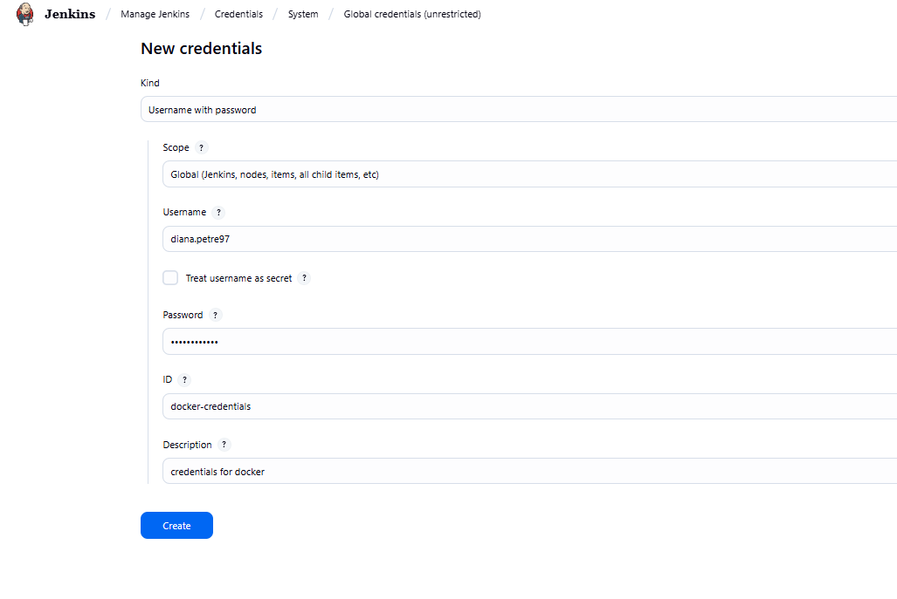

Pentru configurarea agentului, trebuie sa copiem cheia publica de pe masina remote si sa o adaugam in jenkins. Avem nevoie si de adresa ip a masinii.
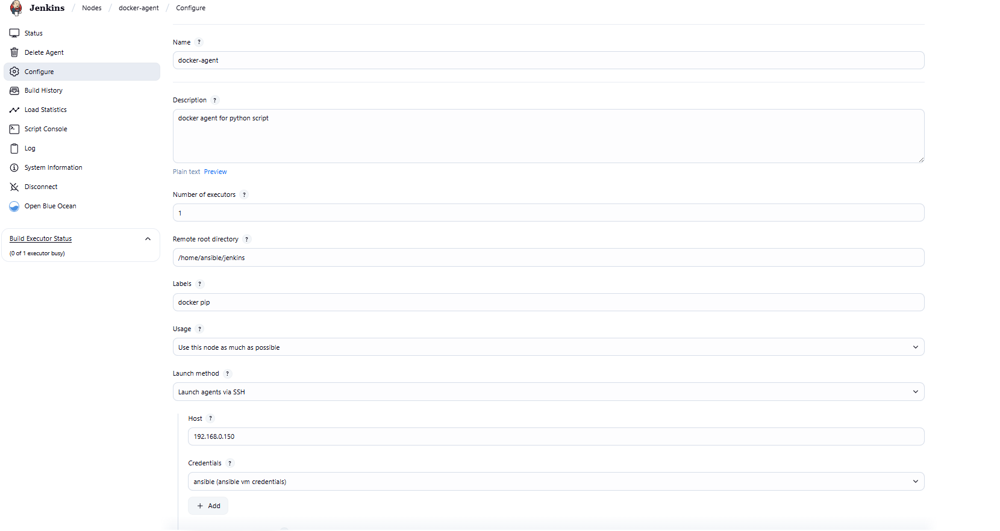

Configuram pipelinurile astfel incat Jenkinsfileurile sa fie citite direct din Git
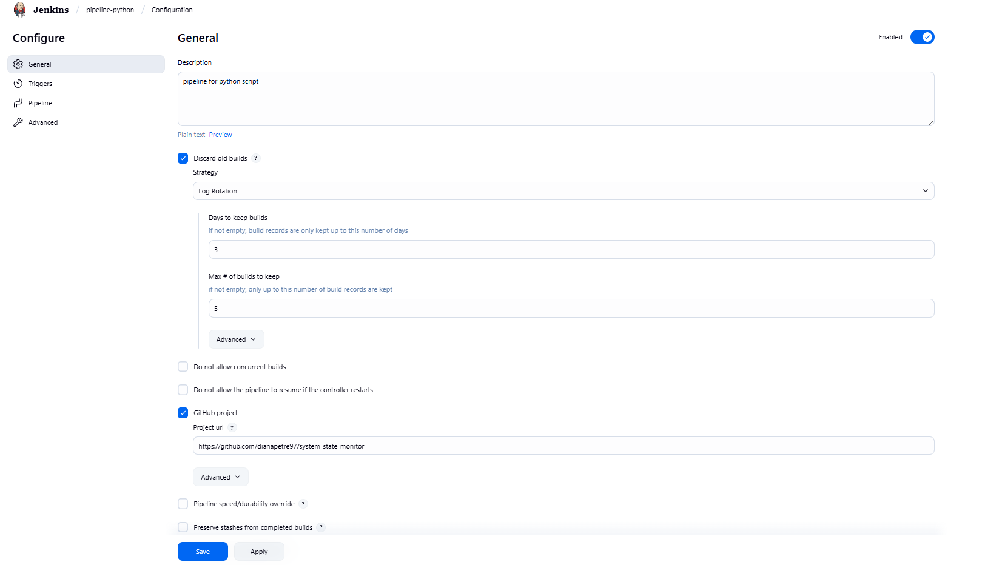
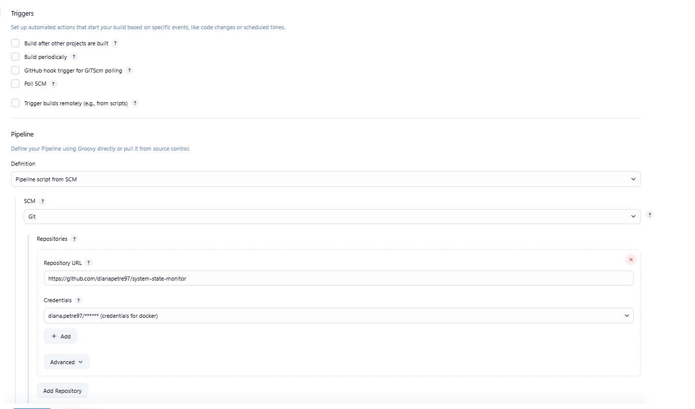
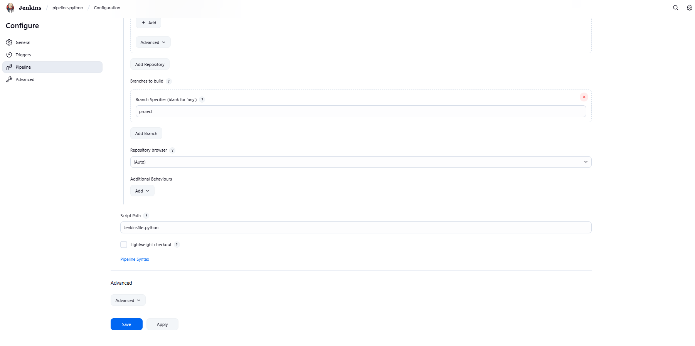

Pe langa Jenkinsfile mai avem nevoie de:
- requierments.txt --> contine lista de packete necesare pentru a rula testele
- Dockerfile
- app.py
- test_app.py --> contine testele unitare

Dupa ce am creat, rulam in Jenkins si vizualizam rezultatul in Blue Ocean.

Primul stage din pipeline este stage-ul de lint. Cu ajutorul acestuia verificam sintaxa de python, daca este corecta, daca respecta standardele.

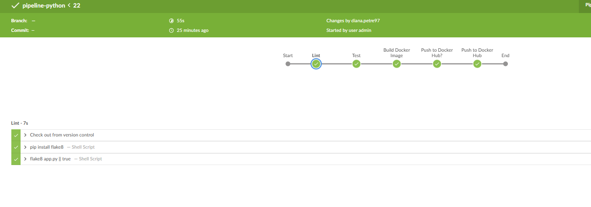

Al doila stage este cel in care rulam testele unitare pentru a verifica daca codul Python e corect.

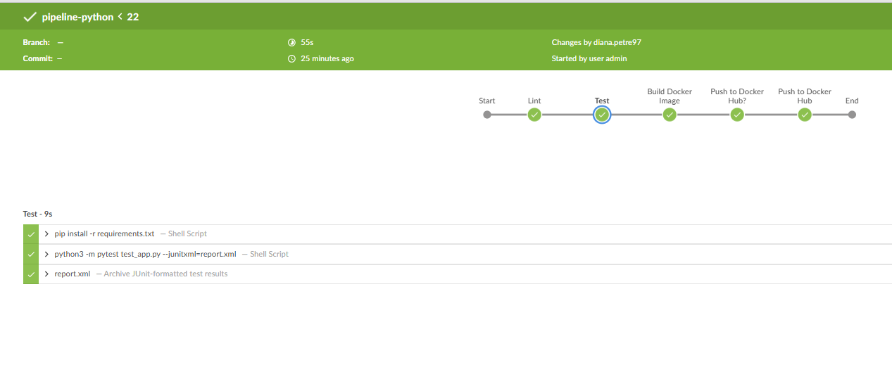

Al reilea stage e cel in care construim imaginea de Docker

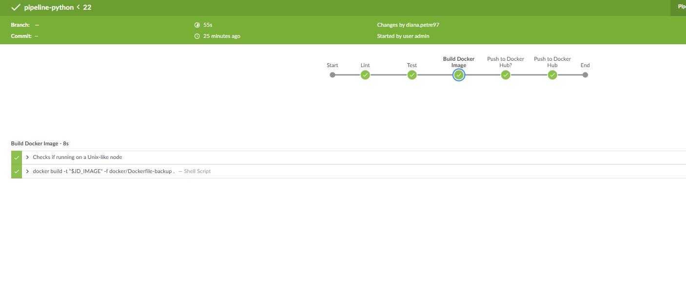

Al  patrulea stage e cel in care cerem uitilizatorului un input, daca este de acord sa incarce imaginea builduita anterior pe DockerHub sau nu.

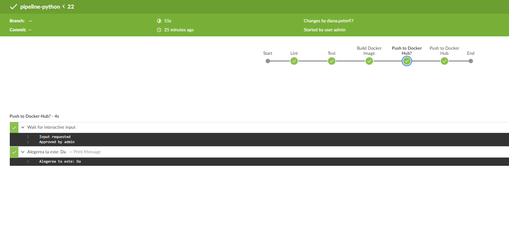

Imaginea a fost incarcata cu succes pe DockerHub

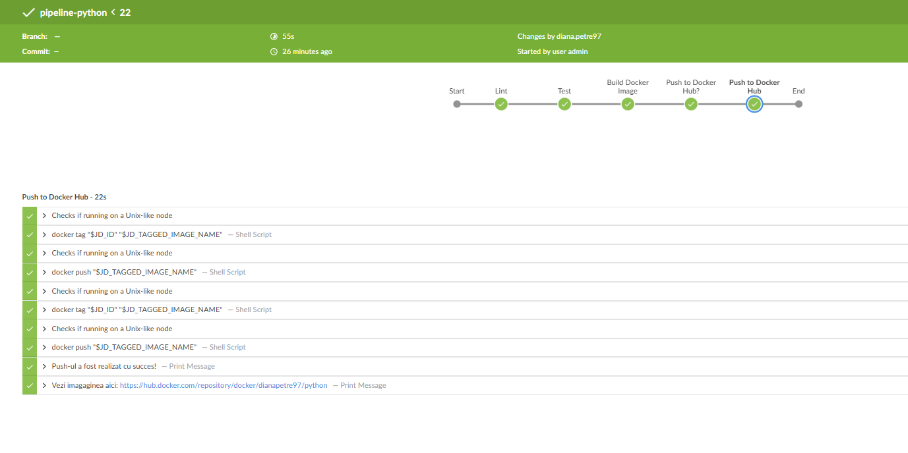

Imaginea s-a incarcat pe DockerHub

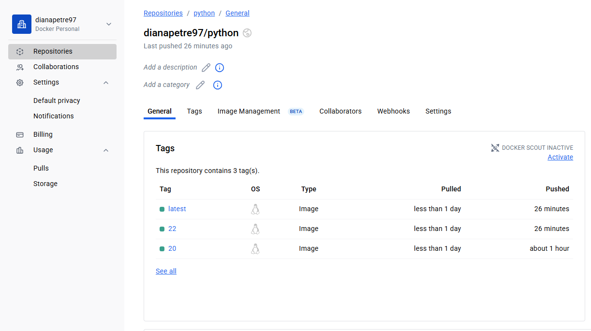

Cazul in care nu vrem sa incarcam imaginea pe DockerHub

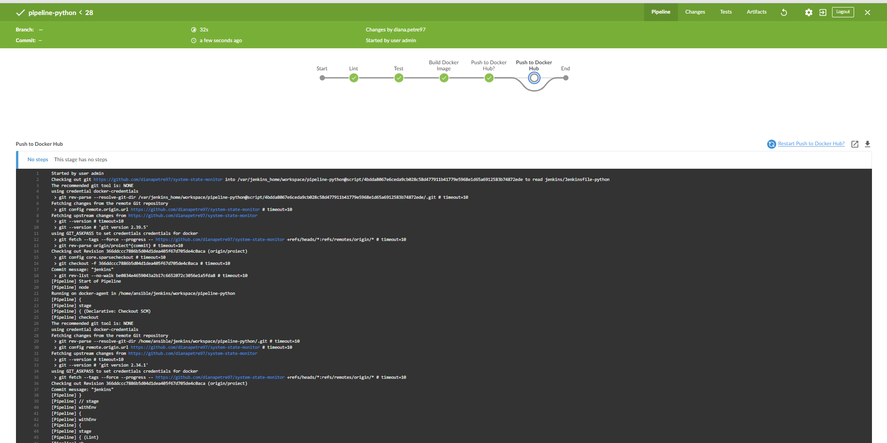

Procedam la fel si pentru scriptul de bash. 

Am creat un user nou caruiam i-am atribuit un rol nou si am creat un view in care poate vede doar cele 2 pipelineuri

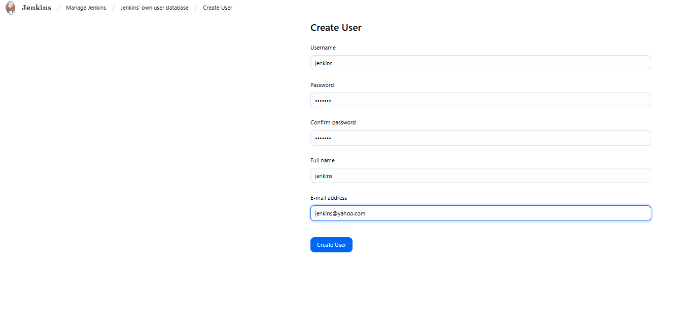
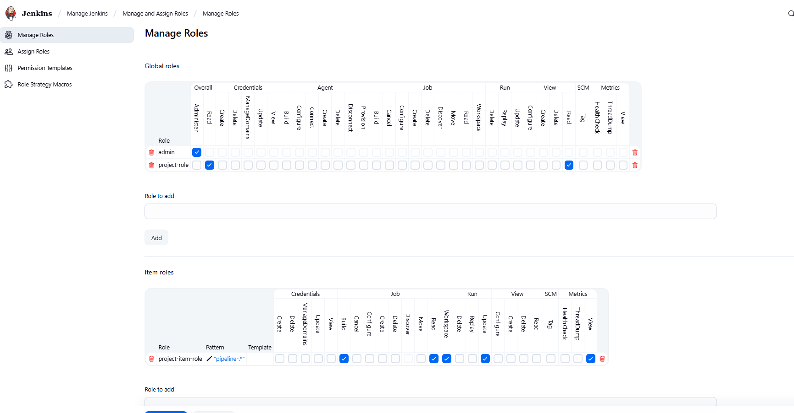
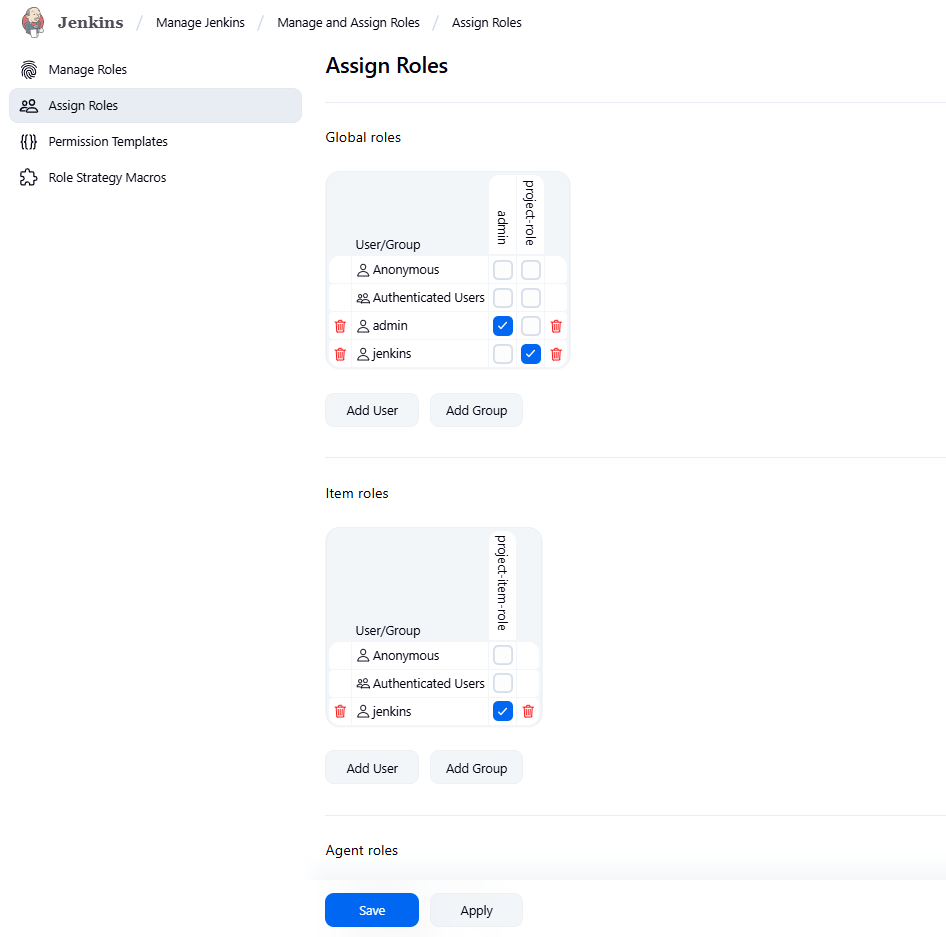
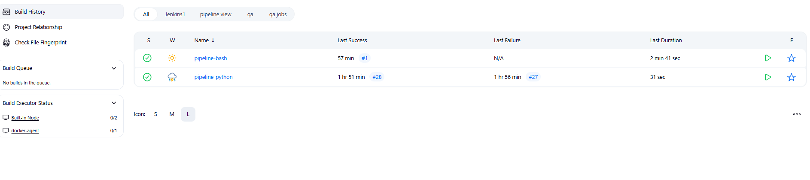


### Terraform & AWS 

**AWS și Terraform** sunt folosite pentru provizionarea infrastructurii platformei, in cazul nostru, totul este local.

Trebuie sa avem instalat :
```
aws@aws:~/system-state-monitor/terraform$ localstack --version
LocalStack CLI 4.5.0

```
Si python3 
```
aws@aws:~/system-state-monitor/terraform$ python3 --version
Python 3.10.12
```
Si Terraform
```
aws@aws:~/system-state-monitor/terraform$ terraform --version
Terraform v1.12.2
on linux_amd64
+ provider registry.terraform.io/hashicorp/aws v6.0.0
```
Si AWS
```
aws@aws:~/system-state-monitor/terraform$ aws --version
aws-cli/1.22.34 Python/3.10.12 Linux/6.8.0-60-generic botocore/1.38.41
```
Userul trebuie sa fien adaugat in grupul de useri aws
```
aws@aws:~/system-state-monitor/terraform$ groups
aws sudo docker vboxsf
```
De fiecare data trebuie sa pornim containerul de localstack cu comadna: **lst start**
Comenzi de rulare:
- tf init
- tf plan
- tf apply

Daca vrem sa vedem starea curenta: tf show

## Resurse
- [Install Docker](https://docs.docker.com/engine/install/ubuntu/)

- [Docker compose documentation](https://docs.docker.com/reference/compose-file/build/)

- [Cont Docker Hub](https://hub.docker.com/repositories/dianapetre97)  

- [AWS Documentation](https://registry.terraform.io/providers/hashicorp/aws/latest/docs)

- [Sintaxa Markdown](https://www.markdownguide.org/cheat-sheet/)

